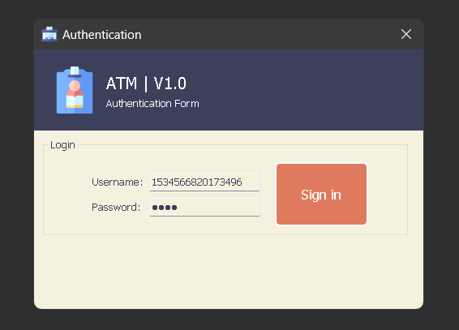
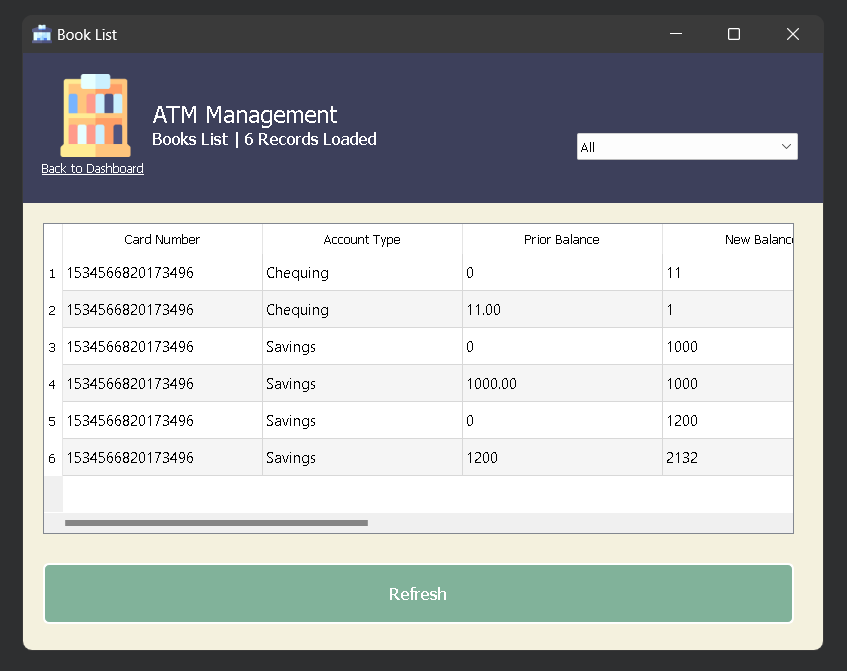

# Mini-Transactions

**Mini-Transactions** is a basic desktop application built with Qt5 mingw for managing and showing transaction data.

---

## ✨ Features

### 🔒 Secure Login System
- **User Authentication**: Reads and validates user credentials from a secure `.txt` file.
- **Error Handling**: Displays appropriate error messages for invalid credentials.
- **Session Management**: Automatically redirects authenticated users to the main dashboard.
-

-
---

### 💼 Comprehensive Transaction Management
#### **Transaction List**
- Displays transactions in an organized, tabular format.
- Supports large datasets with smooth scrolling and optimized rendering.
- Dynamic resizing for different screen sizes.


#### **Filtering**
- Filter transactions based on:
  - Specific date ranges.
  - Transaction type (e.g., income, expense).
  - Categories (e.g., groceries, rent, salary).
- Combine multiple filters for granular data analysis.

---

### 🎨 User Interface and Customization
- **Intuitive Design**: Widget-based layout for easy navigation.
- **Accessibility**: Resizable windows and adjustable table column widths.
- **Multi-page Layout**: Logical separation of functionalities for better usability.

---

## 🚀 Getting Started

### 🛠️ Prerequisites
Ensure the following software is installed:
- **Qt5.15 Framework**: Tested with mingw32.

### 🔧 Installation

1. **Clone the Repository**:
   ```bash
   git clone https://github.com/Mohammad-Imran01/mini-transactions.git
   cd mini-transactions
